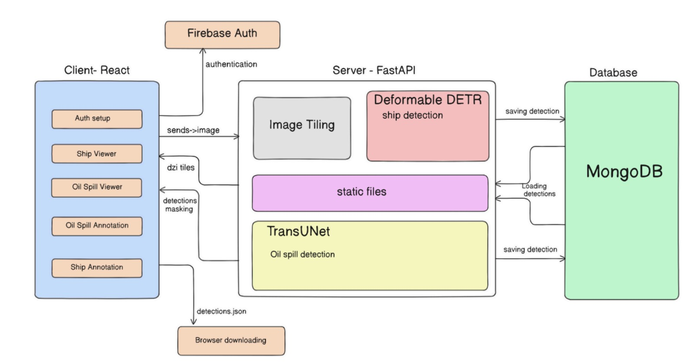

# SAR Marine Surveillance System

Modern maritime monitoring faces significant challenges: millions of square miles of ocean must be surveilled to identify unauthorized vessels and detect ecological disasters such as oil spills. Manual analysis of high-resolution Synthetic Aperture Radar (SAR) imagery is computationally intensive, extremely time-consuming, and prone to human error.

The **SAR Marine Surveillance System** is an enterprise-grade, deep learning-powered platform designed to solve this problem. It automates the analysis of gigapixel satellite images, delivering real-time, highly accurate detection of maritime objects and environmental hazards.

---

## 🌟 Full Feature Breakdown & Real-World Use Cases

The platform is built with a highly specialized toolkit designed for maritime operators, defense agencies, and environmental monitoring teams. Here is a breakdown of every core feature, what it does, and exactly when it comes in handy:

### 1. Context-Aware AI Upload Workspaces
- **What it does:** The system provides strictly separated environments for Ship Detection and Oil Spill Detection. Uploads are strictly mapped to their respective AI pipelines to prevent data contamination.
- **When it comes in handy:** When an operator is rapidly processing a backlog of satellite imagery, this ensures they don't accidentally run an oil spill model on a shipping lane image, saving massive amounts of compute time.

### 2. Gigapixel Deep Zoom Viewer (OpenSeadragon)
- **What it does:** Standard browsers crash when attempting to load 1GB+ TIFF images. Our engine slices these raw satellite images into tiny, optimized Deep Zoom Image (DZI) tiles on the fly. It functions just like Google Maps—only fetching the exact pixels you are actively viewing.
- **When it comes in handy:** When you need to inspect high-resolution SAR data down to the individual pixel level without downloading massive files or crashing your workstation.

### 3. Deformable DETR (Ship Detection Pipeline)
- **What it does:** A specialized Detection Transformer model utilizing a ResNet-50 backbone and deformable self-attention mechanisms. It maps dynamic bounding boxes around vessels.
- **When it comes in handy:** **Coastal Security & Defense.** This feature is critical for detecting "dark ships" (unauthorized or illegal vessels that have disabled their AIS transponders). It allows border security to spot illegal fishing or smuggling operations instantly in heavily cluttered sea conditions.

### 4. TransUNet (Oil Spill Segmentation Pipeline)
- **What it does:** A hybrid architecture combining the granular spatial feature extraction of a Convolutional Neural Network (U-Net) with the global contextual awareness of Vision Transformers. It generates a pixel-perfect segmentation mask outlining the hazard.
- **When it comes in handy:** **Environmental Protection.** Oil spills spread rapidly and irregularly due to ocean currents. This feature allows rapid response teams to see the exact boundaries of a spill immediately after a satellite pass, directing containment booms precisely where they are needed to prevent ecological catastrophe.

### 5. Synchronized Multi-Panel Analysis
- **What it does:** The interface provides up to three side-by-side viewports (Original SAR, AI Mask, Blended Overlay) that are mathematically synchronized. Panning or zooming in one panel instantly updates the others.
- **When it comes in handy:** When verifying AI results. Operators need to ensure the AI isn't hallucinating due to radar noise (like a natural oil seep or a wake). The synchronized panels allow human experts to rapidly cross-reference the raw radar data against the AI's predictions without manually panning back and forth.

### 6. Asynchronous Job Orchestration & Webhooks
- **What it does:** Heavy AI workloads are offloaded to a dedicated GPU Python microservice. The Node.js gateway acts as a secure queue manager, tracking the job state and listening for a webhook callback once the Python engine finishes.
- **When it comes in handy:** When processing multiple massive images simultaneously. The frontend stays perfectly responsive, polling for progress, while the backend chews through the compute-heavy tasks without dropping user requests.

---

## High-Level Architecture



The platform utilizes a decoupled, three-tier microservice architecture to ensure high availability and responsiveness:

1. **Client Interface (React.js):** The high-performance frontend dashboard utilizing Vite, TailwindCSS, and OpenSeadragon.
2. **Gateway API (Node.js/Express):** Acts as the secure orchestration layer handling authentication (Firebase), data persistence (MongoDB), and job queuing.
3. **Machine Learning Service (Python/FastAPI):** A GPU-accelerated inference engine running the Deformable DETR and TransUNet models, utilizing `pyvips` for on-the-fly image tiling.

---

## Deployment & Setup

### Prerequisites
- Docker & Docker Compose
- Node.js (v18+)
- Python (v3.11+)
- MongoDB 

### 1. Configuration
Securely configure your environment variables using the provided templates:
```bash
cp sar-fe/.env.example sar-fe/.env
cp sar_marine_backend/.env.example sar_marine_backend/.env
```
*Note: Your `.env` files contain sensitive credentials and are safely ignored by git.*

### 2. ML Inference Engine (Docker)
The Python ML service is containerized for cross-platform compatibility and seamless GPU allocation. It mounts a shared storage volume to exchange large `.tiff` uploads and `.dzi` outputs with the Node.js API.

```bash
# Start the ML Backend with GPU acceleration (CUDA 12.1)
docker run --gpus all -p 8000:8000 -v "${PWD}\sar_marine_backend\shared:/app/shared" maheshkiran/sar-model-backend
```

### 3. API Gateway
Start the Node.js orchestration server:
```bash
cd sar_marine_backend/server
npm install
npm start
```

### 4. Client Application
Start the frontend interface:
```bash
cd sar-fe
npm install
npm run dev
```
Navigate to `http://localhost:5173` to access the surveillance dashboard.
